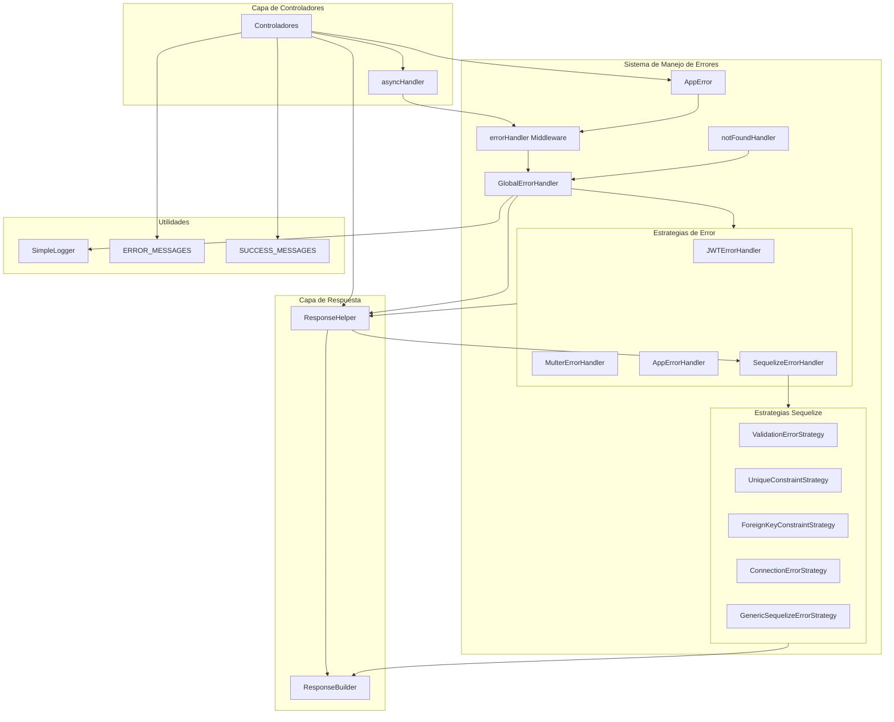
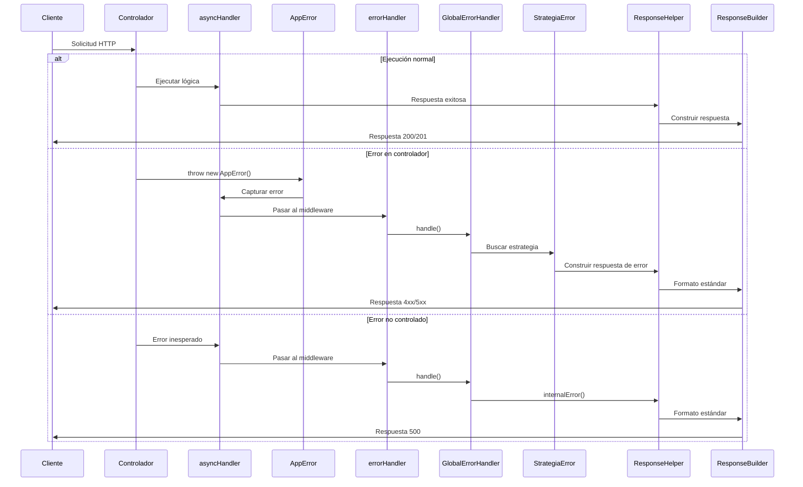
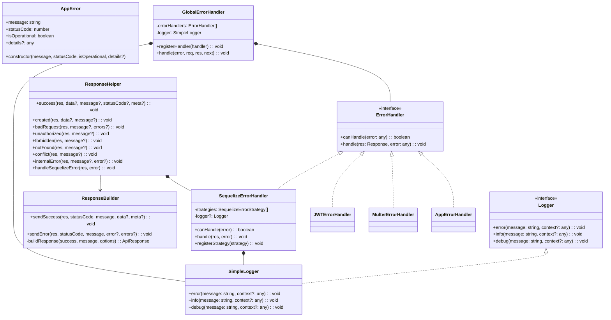
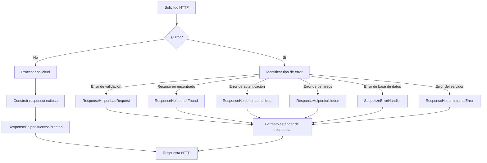

# Diagrama del Sistema de Manejo de Errores

## Diagrama de Componentes

```mermaid
graph TD
  subgraph ControlLayer[Capa de Controladores]
    Controllers[Controladores]
    AsyncHandler[asyncHandler]
  end
  
  subgraph ErrorHandling[Sistema de Manejo de Errores]
    AppError[AppError]
    GlobalErrorHandler[GlobalErrorHandler]
    ErrorHandler[errorHandler Middleware]
    NotFoundHandler[notFoundHandler]
    
    subgraph ErrorStrategies[Estrategias de Error]
      JWTErrorHandler[JWTErrorHandler]
      MulterErrorHandler[MulterErrorHandler]
      AppErrorHandler[AppErrorHandler]
      SeqErrorHandler[SequelizeErrorHandler]
    end
    
    SeqErrorHandler --> SeqStrategies
    
    subgraph SeqStrategies[Estrategias Sequelize]
      ValidationStrategy[ValidationErrorStrategy]
      UniqueConstraintStrategy[UniqueConstraintStrategy]
      ForeignKeyStrategy[ForeignKeyConstraintStrategy]
      ConnectionStrategy[ConnectionErrorStrategy]
      GenericSeqStrategy[GenericSequelizeErrorStrategy]
    end
  end
  
  subgraph ResponseLayer[Capa de Respuesta]
    ResponseHelper[ResponseHelper]
    ResponseBuilder[ResponseBuilder]
  end
  
  subgraph Utilities[Utilidades]
    Logger[SimpleLogger]
    ErrorMessages[ERROR_MESSAGES]
    SuccessMessages[SUCCESS_MESSAGES]
  end
  
  Controllers --> AsyncHandler
  Controllers --> ResponseHelper
  Controllers --> AppError
  AsyncHandler --> ErrorHandler
  AppError --> ErrorHandler
  ErrorHandler --> GlobalErrorHandler
  NotFoundHandler --> GlobalErrorHandler
  
  GlobalErrorHandler --> ErrorStrategies
  GlobalErrorHandler --> ResponseHelper
  GlobalErrorHandler --> Logger
  
  ResponseHelper --> ResponseBuilder
  ResponseHelper --> SeqErrorHandler
  
  ErrorStrategies --> ResponseHelper
  SeqStrategies --> ResponseBuilder
  
  Controllers --> ErrorMessages
  Controllers --> SuccessMessages
```

## Flujo de Manejo de Errores

```mermaid
sequenceDiagram
  participant Cliente
  participant Controlador
  participant asyncHandler
  participant AppError
  participant errorHandler
  participant GlobalErrorHandler
  participant StrategiaError
  participant ResponseHelper
  participant ResponseBuilder
  
  Cliente->>Controlador: Solicitud HTTP
  
  alt Ejecución normal
    Controlador->>asyncHandler: Ejecutar lógica
    asyncHandler->>ResponseHelper: Respuesta exitosa
    ResponseHelper->>ResponseBuilder: Construir respuesta
    ResponseBuilder->>Cliente: Respuesta 200/201
  else Error en controlador
    Controlador->>AppError: throw new AppError()
    AppError->>asyncHandler: Capturar error
    asyncHandler->>errorHandler: Pasar al middleware
    errorHandler->>GlobalErrorHandler: handle()
    GlobalErrorHandler->>StrategiaError: Buscar estrategia
    StrategiaError->>ResponseHelper: Construir respuesta de error
    ResponseHelper->>ResponseBuilder: Formato estándar
    ResponseBuilder->>Cliente: Respuesta 4xx/5xx
  else Error no controlado
    Controlador->>asyncHandler: Error inesperado
    asyncHandler->>errorHandler: Pasar al middleware
    errorHandler->>GlobalErrorHandler: handle()
    GlobalErrorHandler->>ResponseHelper: internalError()
    ResponseHelper->>ResponseBuilder: Formato estándar
    ResponseBuilder->>Cliente: Respuesta 500
  end
```

## Estructura de Clases

```mermaid
classDiagram
  class ErrorHandler {
    <<interface>>
    +canHandle(error: any): boolean
    +handle(res: Response, error: any): void
  }
  
  class Logger {
    <<interface>>
    +error(message: string, context?: any): void
    +info(message: string, context?: any): void
    +debug(message: string, context?: any): void
  }
  
  class SimpleLogger {
    +error(message: string, context?: any): void
    +info(message: string, context?: any): void
    +debug(message: string, context?: any): void
  }
  
  class ResponseBuilder {
    +sendSuccess(res, statusCode, message, data?, meta?): void
    +sendError(res, statusCode, message, error?, errors?): void
    -buildResponse(success, message, options): ApiResponse
  }
  
  class ResponseHelper {
    +success(res, data?, message?, statusCode?, meta?): void
    +created(res, data?, message?): void
    +badRequest(res, message?, errors?): void
    +unauthorized(res, message?): void
    +forbidden(res, message?): void
    +notFound(res, message?): void
    +conflict(res, message?): void
    +internalError(res, message?, error?): void
    +handleSequelizeError(res, error): void
  }
  
  class SequelizeErrorHandler {
    -strategies: SequelizeErrorStrategy[]
    -logger?: Logger
    +canHandle(error): boolean
    +handle(res, error): void
    +registerStrategy(strategy): void
  }
  
  class AppError {
    +message: string
    +statusCode: number
    +isOperational: boolean
    +details?: any
    +constructor(message, statusCode, isOperational, details?)
  }
  
  class GlobalErrorHandler {
    -errorHandlers: ErrorHandler[]
    -logger: SimpleLogger
    +registerHandler(handler): void
    +handle(error, req, res, next): void
  }
  
  Logger <|.. SimpleLogger
  ErrorHandler <|.. SequelizeErrorHandler
  ErrorHandler <|.. JWTErrorHandler
  ErrorHandler <|.. MulterErrorHandler
  ErrorHandler <|.. AppErrorHandler
  
  GlobalErrorHandler *-- ErrorHandler
  ResponseHelper --> ResponseBuilder
  ResponseHelper *-- SequelizeErrorHandler
  SequelizeErrorHandler *-- SimpleLogger
  GlobalErrorHandler *-- SimpleLogger
```

## Flujo de Respuesta API

```mermaid
flowchart TD
  A[Solicitud HTTP] --> B{¿Error?}
  B -->|No| C[Procesar solicitud]
  C --> D[Construir respuesta exitosa]
  D --> E[ResponseHelper.success/created]
  
  B -->|Sí| F[Identificar tipo de error]
  
  F -->|Error de validación| G[ResponseHelper.badRequest]
  F -->|Recurso no encontrado| H[ResponseHelper.notFound]
  F -->|Error de autenticación| I[ResponseHelper.unauthorized]
  F -->|Error de permisos| J[ResponseHelper.forbidden]
  F -->|Error de base de datos| K[SequelizeErrorHandler]
  F -->|Error del servidor| L[ResponseHelper.internalError]
  
  G --> M[Formato estándar de respuesta]
  H --> M
  I --> M
  J --> M
  K --> M
  L --> M
  
  E --> N[Respuesta HTTP]
  M --> N
```
